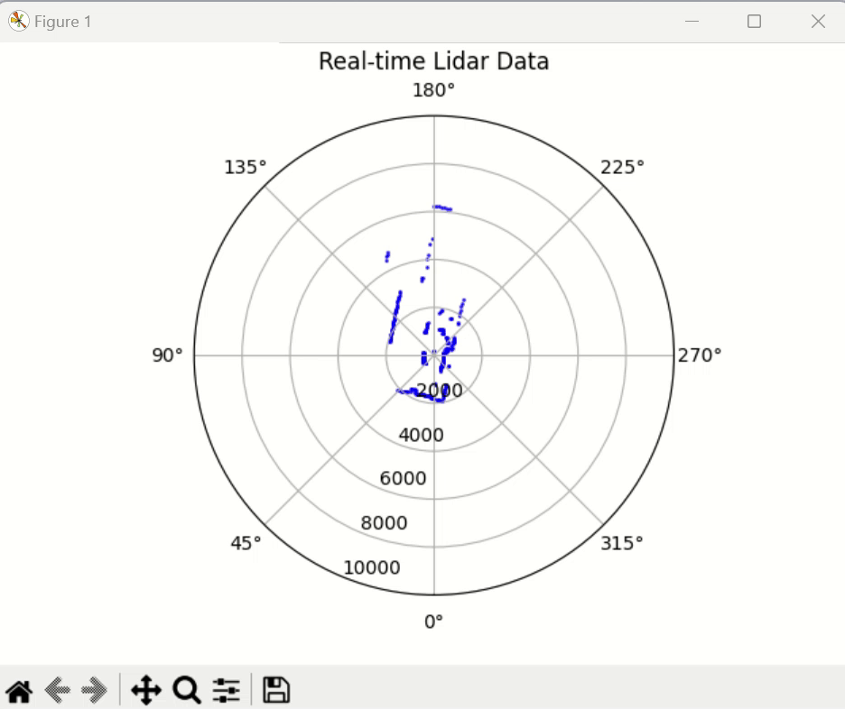

[Japanese(Google Translate)](https://github-com.translate.goog/covao/LidarLD19/blob/main/README.md?_x_tr_sl=en&_x_tr_tl=ja&_x_tr_hl=ja&_x_tr_pto=wapp) 

# LidarLD19
LidarLD19 is a Donkey Car part that reads and parses serial data from the LD19 Lidar sensor, normalizes scan data, and provides real-time 2D Lidar plotting for distance and angle measurements using matplotlib.

